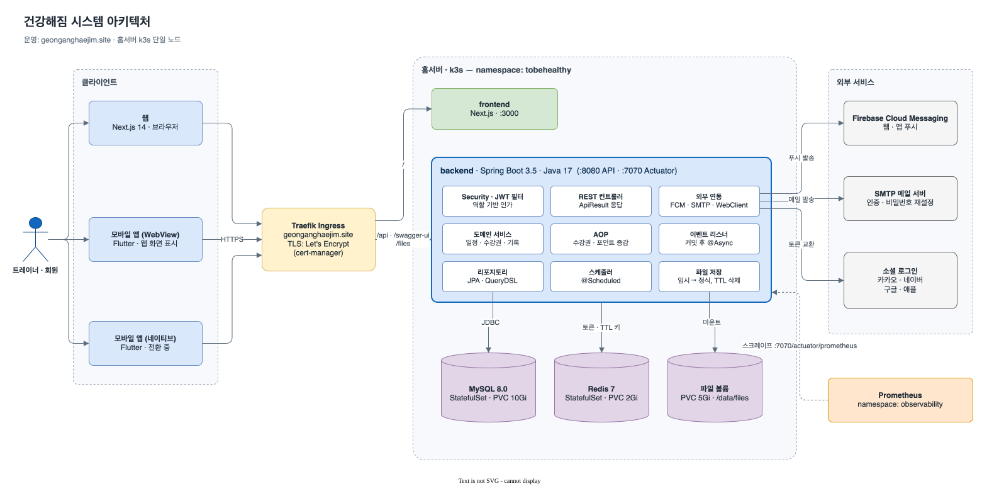
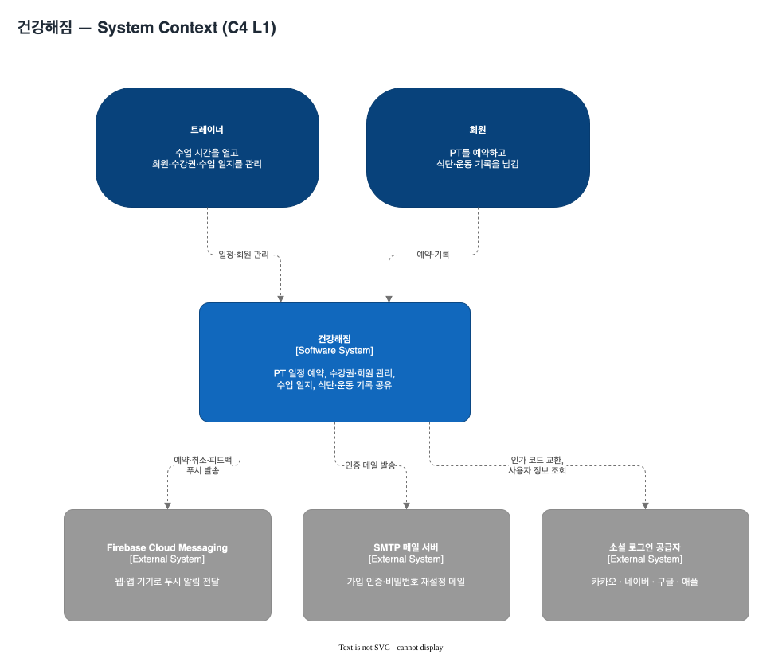
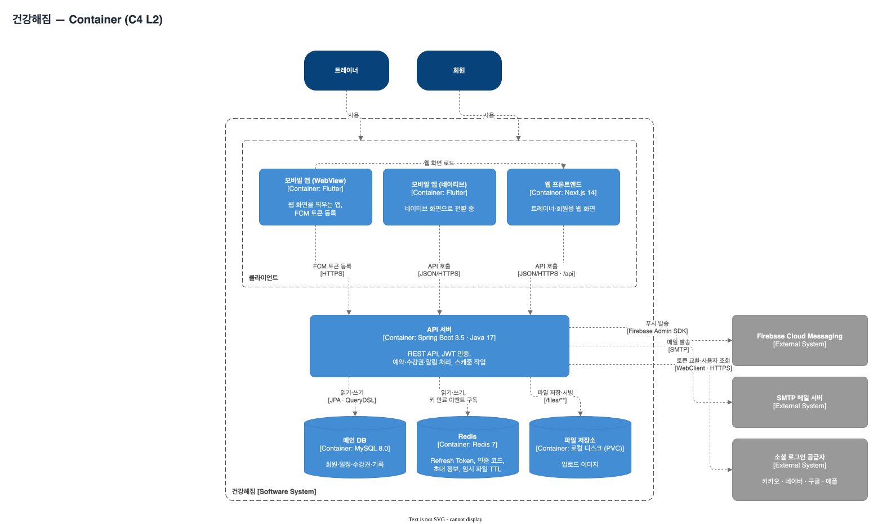
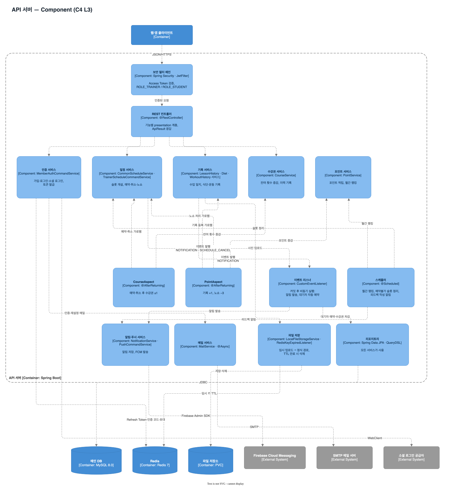
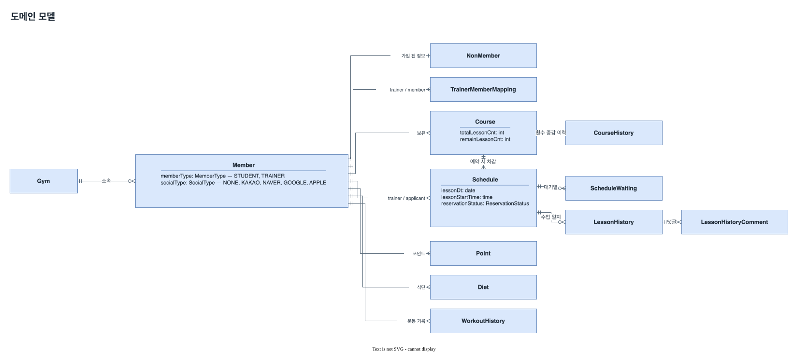
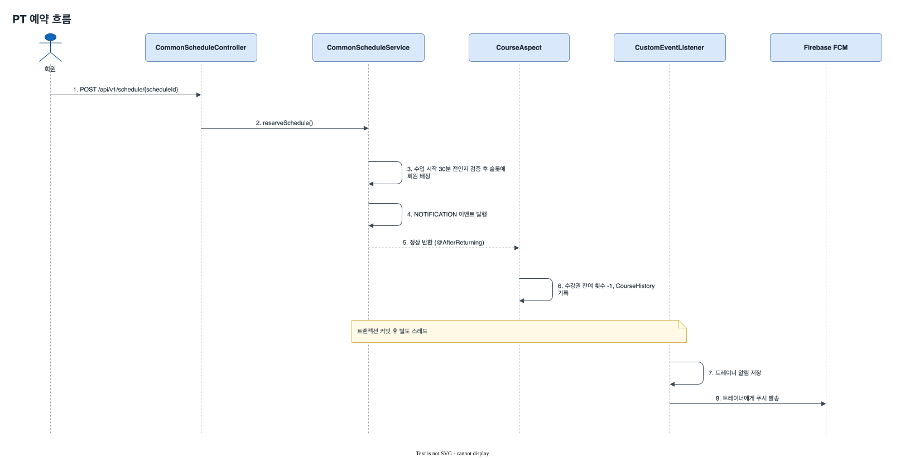
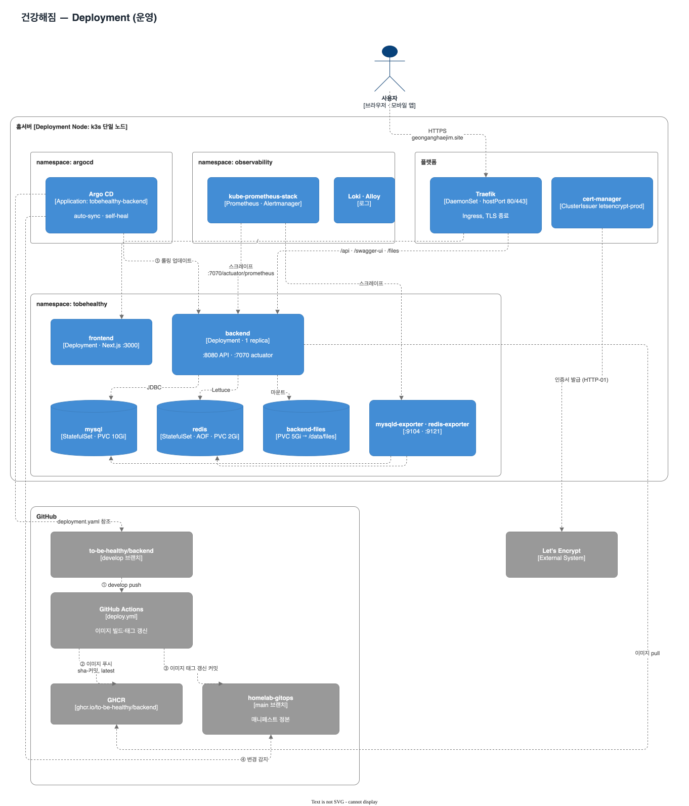

<p align="center">
    
    <br />
    <h1 align="center">건강해짐 Backend</h1>
    <p align="center">피트니스 센터, 트레이너와 회원을 위한 PT 일정·회원 관리 앱의 API 서버</p>
    <br />
    <p align="center">
      <a href="https://geonganghaejim.site/">웹 사이트</a>
      ·
      <a href="https://geonganghaejim.site/swagger-ui/index.html">API 문서 (Swagger)</a>
    </p>
</p>

<br />

## 건강해짐은 어떤 서비스인가요


헬스장의 PT 트레이너와 회원은 보통 수기 메모나 카카오톡으로 수업 일정을 잡아요. 예약이 대화방에 흩어지고,
남은 수업 횟수는 트레이너가 따로 세고, 수업 피드백은 말로 하고 끝나죠.

건강해짐은 이 과정을 앱 하나로 모았어요. **트레이너는 수업 가능한 시간을 열어두고, 회원은 빈 시간을 골라 직접
예약해요.** 예약하면 수강권 횟수가 자동으로 차감되고 상대방에게 푸시 알림이 가요. 수업이 끝나면 트레이너가 수업
일지로 피드백을 남기고, 회원은 식단과 운동 기록을 쌓아 트레이너와 공유해요.

### 사용자별 기능

사용자는 **트레이너**와 **회원** 두 종류예요.

| 영역 | 트레이너 | 회원 |
|---|---|---|
| 연결 | 초대 링크로 회원 초대 + 수강권 발급 | 초대 링크로 가입하면 트레이너와 자동 연결 |
| 일정 | 기본 수업 시간·휴무일 설정, 수업 슬롯 개설, 회원 대신 예약, 노쇼 처리 | 빈 슬롯 예약·취소, 마감된 슬롯에 대기 신청 |
| 수강권 | 발급·횟수 조정, 증감 이력 확인 | 잔여 횟수·이력 확인 |
| 피드백 | 수업마다 수업 일지(피드백) 작성 | 수업 일지 확인, 댓글 |
| 기록 | 회원의 식단·운동 기록 확인 | 식단·운동 기록 작성, 커뮤니티 피드 |
| 동기부여 | 회원별 메모, 포인트 랭킹 확인 | 활동 포인트 적립, 월간 랭킹 |

<details>
<summary>기능 소개 이미지</summary>


</details>

<br />

## 시스템 아키텍처

백엔드는 **단일 Spring Boot 애플리케이션(모놀리스)** 입니다. Gradle 모듈도 하나이고, 모든 클라이언트가 같은
도메인(`geonganghaejim.site`)의 Ingress를 거쳐 들어와요.



> 이 README의 다이어그램은 모두 draw.io 파일(`docs/diagrams/*.drawio.svg`)이라 draw.io에서 바로 열어 고칠 수 있어요.

같은 구조를 [C4 모델](https://c4model.com/)의 수준별로 나누면 다음과 같아요.

**L1 System Context** — 누가 쓰고, 어떤 외부 시스템과 연동하는지



**L2 Container** — 시스템을 이루는 실행 단위와 저장소



| 구성 요소 | 역할 |
|---|---|
| **frontend** | Next.js 웹. WebView 앱은 이 웹을 그대로 띄워요 |
| **backend** (이 레포) | REST API, 인증, 스케줄링·알림 발송 |
| **MySQL** | 모든 업무 데이터 |
| **Redis** | Refresh Token, 인증 코드, 초대 정보, 임시 업로드 파일 추적 (→ [Redis 사용처](#redis-사용처)) |
| **파일 볼륨** | 업로드 이미지(식단·운동·수업 일지 사진, 프로필) — S3가 아닌 로컬 디스크 |
| **Firebase / SMTP / OAuth** | 푸시 알림, 이메일 인증·비밀번호 재설정, 소셜 로그인 |

Ingress 경로 규칙은 `/api`, `/swagger-ui`, `/v3/api-docs`, `/files`가 backend로, 나머지(`/`)는 frontend로
갑니다. 애플 웹 로그인 콜백 `/api/callback/apple` 하나만 예외로 frontend가 받아요.

<br />

## 애플리케이션 구조

### 패키지: 기능별로 나누고, 그 안을 계층으로 나눈다

`src/main/java/com/tobe/healthy/` 아래에 **기능(feature) 단위 패키지**가 있고, 각 패키지 안은 같은 계층 구조를
따릅니다.

| 패키지 | 하는 일 | API base path |
|---|---|---|
| `member` | 회원·트레이너 계정, 일반/소셜 로그인, 프로필, 알림 설정, 탈퇴, 회원별 기록·수강권·포인트 조회 | `/api/v1/auth`, `/api/v1/members`, `/api/v2/members` |
| `gym` | 헬스장, 가입 코드로 헬스장 소속 | `/api/v1/gyms` |
| `trainer` | 트레이너–회원 연결, 회원 초대, 회원 메모 | `/api/v1/trainers` |
| `course` | 수강권 발급·수정·삭제, 잔여 횟수, 증감 이력 | `/api/v1/course` (조회는 `/api/v1/members/course`) |
| `schedule` | 트레이너 수업 시간 설정, 슬롯 개설, 예약·취소·대기·노쇼 | `/api/v1/schedule` (`/student`, `/waiting`) |
| `lessonhistory` | 수업 일지(피드백), 댓글·사진 | `/api/v1/lessonhistory` |
| `diet` | 식단 기록, 사진·좋아요·댓글 | `/api/v1/diets` |
| `workout` | 운동 종목 카탈로그, 운동 기록, 커뮤니티 피드 | `/api/v1/exercise`, `/api/v1/workout-histories`, `/api/v1/community` |
| `point` | 활동 포인트, 월간 랭킹 | — (다른 모듈이 사용) |
| `home` | 홈 화면용 집계 API | `/api/v1/home` |
| `notification` | 앱 내 알림함, 읽음 처리 | `/api/v1/notification` |
| `push` | FCM 기기 토큰 등록, 푸시 발송 | `/api/v1/push` |
| `file` | 파일 업로드 (업로드된 파일은 `/files/**`로 정적 서빙) | `/api/v1/file` |
| `common` | 공통 예외·`ErrorCode`, AOP, 이벤트, Redis, 스케줄러 | — |
| `config` | Security·JWT, Redis, WebClient, Firebase, JPA/QueryDSL, Swagger, P6Spy | — |

### 컴포넌트 (C4 L3)

API 서버 안에서 요청이 흐르는 길과, 서비스 코드 밖에서 동작하는 Aspect·이벤트 리스너·스케줄러의 관계예요.



### 계층

| 계층 | 담는 것 |
|---|---|
| `presentation` | `*Controller`와 요청/응답 DTO (`dto/in`, `dto/out`) |
| `application` | `*Service` — 트랜잭션 경계, 유스케이스 조합, 외부 시스템 호출 |
| `domain` | JPA 엔티티, enum, 상태를 바꾸는 도메인 메서드 (예: `Schedule.registerSchedule`) |
| `repository` | Spring Data JPA 인터페이스 + QueryDSL 구현 |

`file`·`home`은 자체 엔티티가 없어 `presentation`·`application`만 있고, `point`는 컨트롤러 없이 다른 모듈에서
호출돼요.

### 코드 컨벤션

- **조회와 명령 분리** — 많은 모듈이 조회용과 변경용 컨트롤러·서비스를 나눠요.
  예: `GymController` / `GymCommandController`, `TrainerScheduleCommandService`.
- **DTO 접두사** — 쓰기 요청은 `Command*`, 조회 결과는 `Retrieve*`. 그 외에 `*Response`, `*Result`,
  검색 조건 `*Cond`를 써요.
- **동적 쿼리** — `XxxRepository extends JpaRepository, XxxRepositoryCustom`, 구현은 `XxxRepositoryCustomImpl`에
  QueryDSL로 작성합니다.
- **JPA 설정** — `open-in-view: false`, `default_batch_fetch_size: 100`(N+1 완화), 예약어 충돌을 막으려고
  식별자를 전부 따옴표로 감싸요(`globally_quoted_identifiers`).

<br />

## 도메인 모델



| 개념 | 엔티티 | 설명 |
|---|---|---|
| 회원·트레이너 | `Member` | 트레이너도 회원도 같은 엔티티예요. `memberType`으로 구분하고, 이 값이 Security 권한(`ROLE_TRAINER` / `ROLE_STUDENT`)이 됩니다 |
| 가입 전 회원 | `NonMember` | 트레이너가 먼저 등록한, 아직 가입하지 않은 회원. 초대 링크로 가입하면 실제 계정 정보가 합쳐져요 |
| 트레이너–회원 연결 | `TrainerMemberMapping` | 담당 관계와 회원 메모, 이번 달·지난달 포인트 랭킹 |
| 수강권 | `Course` / `CourseHistory` | 트레이너가 발급하는 PT 횟수권. 증감은 모두 `CourseHistory`에 남아요 |
| 수업 슬롯 | `Schedule` | 트레이너가 연 수업 한 타임. 예약한 회원은 `applicant`. 상태는 `AVAILABLE`(예약가능)·`COMPLETED`(예약완료)·`SOLD_OUT`(대기마감)·`NO_SHOW`·`LUNCH_TIME`·`DISABLED`(예약불가) |
| 대기 | `ScheduleWaiting` | 이미 예약된 슬롯의 대기열. 취소가 나면 먼저 신청한 사람부터 자동으로 예약돼요 |
| 트레이너 근무 설정 | `TrainerScheduleInfo`, `TrainerScheduleClosedDaysInfo` | 기본 수업 시간·점심시간·수업 길이, 휴무 요일 |
| 수업 일지 | `LessonHistory` | 수업마다 트레이너가 쓰는 피드백. 회원의 읽음 여부, 댓글·사진 |
| 기록 | `Diet`, `WorkoutHistory` | 회원의 식단·운동 기록. 사진·좋아요·댓글, 운동 기록에는 수행한 종목(`CompletedExercise`)이 붙어요 |
| 포인트 | `Point` | 운동·식단 기록 +1, 노쇼 −3. 매월 트레이너별 회원 랭킹에 쓰여요 |
| 알림 | `Notification`, `MemberToken` | 앱 내 알림함, FCM 기기 토큰 |

<br />

## 핵심 흐름

### PT 예약

회원이 빈 슬롯을 예약하면 수강권 차감과 트레이너 알림이 **예약 로직 밖에서** 일어나요. 수강권은 AOP가, 알림은
트랜잭션 커밋 뒤 비동기 이벤트 리스너가 처리합니다.



> 예약·취소 로직을 고칠 때는 `common/aop/CourseAspect`, `PointAspect`도 같이 봐야 해요. 수강권과 포인트
> 증감이 서비스 코드가 아니라 이 Aspect들에 있습니다.

### 예약 취소와 대기자 자동 예약

1. 회원은 **수업 전날 같은 시각까지만** 취소할 수 있어요(`CommonScheduleService.cancelMemberSchedule`).
2. 취소하면 `CourseAspect`가 수강권 횟수를 되돌리고, `SCHEDULE_CANCEL` 이벤트가 발행돼요.
3. `CustomEventListener`가 가장 먼저 대기한 회원을 꺼내 수강권이 남았는지 확인하고, 남았으면 그 회원으로 예약한
   뒤 수강권을 차감하고 회원·트레이너에게 알림을 보냅니다.

### 트레이너의 회원 초대

1. 트레이너가 이름과 수업 횟수를 입력해 초대하면(`TrainerService.inviteMember`), 초대 정보를 Redis에
   **1일 TTL**로 저장하고 초대 링크를 돌려줘요.
2. 회원이 그 링크로 가입하면(`MemberAuthCommandService.mappingTrainerAndStudent`) 트레이너–회원 연결
   (`TrainerMemberMapping`)과 수강권(`Course`)이 함께 만들어지고, Redis 키는 지워져요.

<br />

## 횡단 관심사

### 인증·인가

- **Stateless JWT** — 세션·CSRF·폼 로그인을 끄고, `JwtFilter`가 요청마다 Access Token을 검증해요.
  Refresh Token은 Redis에 저장합니다.
- **공개 경로** — `/api/v1/auth/**`, Swagger, `/actuator/**`, `/files/**`, `/api/v1/push/webview`,
  `/api/v1/schedule/all/{trainerId}`. 나머지는 모두 인증이 필요해요.
- **역할 권한** — 트레이너 전용·회원 전용 API는 `@PreAuthorize("hasAuthority('ROLE_TRAINER')")` 식으로 막아요.
- **소셜 로그인 (카카오·네이버·구글·애플)** — Spring의 `oauth2Login()`은 쓰지 않아요. 클라이언트가 받은 인가
  코드를 서버가 `WebClient`로 각 공급자의 토큰·사용자 정보 API와 직접 교환합니다(`MemberAuthCommandService`).
  애플은 요청마다 ES256 client secret을 만들고, 애플의 `id_token` 서명을 애플 공개키(JWKS)로 검증해요
  (`AppleJwtConfig` — `oauth2-client` 의존성은 이 검증에만 씁니다).

### 응답 형식

```jsonc
// 성공 — ApiResult<T>
{ "status": "OK", "message": "...", "data": { } }

// 실패 — GlobalExceptionHandler가 변환한 ErrorResponse
{ "message": "...", "code": "C_005", "timestamp": "..." }
```

비즈니스 오류는 `throw new CustomException(ErrorCode.XXX)`로 던져요. `ErrorCode` enum이 HTTP 상태, 오류 코드,
한국어 메시지를 함께 가지고 있습니다.

### AOP

| Aspect | 걸리는 곳 | 하는 일 |
|---|---|---|
| `CourseAspect` | 예약·취소 (회원 직접 / 트레이너 대리) | 수강권 잔여 횟수 차감·복구 + `CourseHistory` 기록 |
| `PointAspect` | 운동 기록·식단 등록, 노쇼 처리·취소 | 포인트 +1, 노쇼 −3 (노쇼 취소 시 복구) |
| `LogAspect` | 모든 `*Controller` 빈 | 요청 메서드·URL·파라미터·처리 시간 로깅 |

### 이벤트와 비동기

`CustomEventPublisher`로 발행한 이벤트를 `CustomEventListener` 하나가 받아요. 리스너는
`@TransactionalEventListener` + `@Async` + `REQUIRES_NEW`라서 **원래 트랜잭션이 커밋된 뒤, 별도 스레드·별도
트랜잭션**에서 돌아요. 알림 발송이 실패해도 예약 자체는 롤백되지 않습니다.

| 이벤트 | 처리 |
|---|---|
| `NOTIFICATION` | 알림 저장 + FCM 푸시 |
| `SCHEDULE_CANCEL` | 대기자 자동 예약 |

이메일 발송(`MailService`)도 `@Async`예요.

### 스케줄 작업 (`common/Scheduler`)

| 주기 | 작업 |
|---|---|
| 매월 1일 01:00 | 트레이너별 회원 포인트 랭킹 갱신 |
| 매주 월요일 00:00 | 예약불가(`DISABLED`) 슬롯 정리 |
| 매일 22:00 | 트레이너에게 수업 일지 작성 알림 |

JVM 기본 타임존은 `Asia/Seoul`로 고정돼 있어요(`HealthyApplication`).

### 파일 저장

S3 없이 **로컬 디스크**에 저장하고 `/files/**`로 정적 서빙해요(`LocalFileStorageService`,
`LocalFileStorageConfig`). 운영에서는 이 디렉터리가 PVC(`/data/files`)예요.

업로드한 파일은 먼저 임시 경로에 두고 Redis에 **30분 TTL** 키를 걸어요. 수업 일지·운동 기록이 저장되면 정식
경로로 옮기고, 저장되지 않은 채 TTL이 끝나면 `RedisKeyExpiredListener`가 만료 이벤트를 받아 파일을 지웁니다.

### Redis 사용처

| 용도 | 키 | TTL |
|---|---|---|
| Refresh Token | `userId` | Refresh Token 유효 기간 |
| 이메일 인증 코드 | 이메일 주소 | 3분 |
| 회원 초대 정보 | `invitation:{uuid}` | 1일 |
| 임시 업로드 파일 | `temp-file-uri:...` | 30분 (만료 시 파일 삭제) |

### 로깅·모니터링

- **Logback** — 콘솔 + `logs/info`, `logs/warn`, `logs/error` 레벨별 롤링 파일(30일 보관, gzip 압축)
- **P6Spy** — `dev` 프로파일에서 실행 SQL과 소요 시간을 로깅
- **Actuator** — API 포트(8080)와 분리된 관리 포트 **7070**에서 `health`, `prometheus`만 노출. Kubernetes
  프로브와 Prometheus 수집이 이 포트를 씁니다

<br />

## 기술 스택

| 분류 | 기술 |
|---|---|
| 언어·빌드 | Java 17, Spring Boot 3.5.13, Gradle 8.14 (Groovy DSL, 단일 모듈) |
| 데이터 | Spring Data JPA, QueryDSL 5.1, MySQL 8.0, Spring Data Redis (Redis 7) |
| 인증 | Spring Security, jjwt 0.12.6, Nimbus JWT Decoder (애플 `id_token` 검증) |
| 외부 연동 | WebClient (소셜 로그인), Firebase Admin SDK 9.5 (FCM), Spring Mail |
| API 문서 | springdoc-openapi 2.8.6 (Swagger UI) |
| 운영 | Spring Actuator, Micrometer Prometheus, P6Spy, Logback |
| 기타 | Lombok, Spring AOP, Bean Validation, ModelMapper, Guava |
| 테스트 | JUnit 5, Mockito, spring-security-test |

<br />

## 배포

`develop` 브랜치에 push하면 운영까지 자동으로 배포돼요. 클러스터에 직접 배포하지 않고, GitOps 레포의 이미지
태그만 바꾸면 Argo CD가 반영하는 구조입니다. 그림의 ①~⑤가 배포 순서예요.



운영 환경은 **홈서버의 k3s 단일 노드**이고, 매니페스트 정본은
[`seonwooj0810-homelab/homelab-gitops`](https://github.com/seonwooj0810-homelab/homelab-gitops)에 있어요.

| 리소스 | 구성 |
|---|---|
| backend | Deployment 1 replica, 무중단 롤링(`maxUnavailable: 0`), 요청 250m/768Mi · 제한 1 CPU/2Gi |
| 헬스 체크 | startup / liveness / readiness 프로브 → `:7070/actuator/health` (`/liveness`, `/readiness`) |
| MySQL | 클러스터 내부 StatefulSet `mysql:8.0`, PVC 10Gi |
| Redis | 클러스터 내부 StatefulSet `redis:7-alpine`, AOF 영속화, PVC 2Gi |
| 업로드 파일 | PVC `backend-files` 5Gi → `/data/files` |
| 설정·비밀 | ConfigMap `backend-config` + Sealed Secrets (DB·Redis·JWT·메일·OAuth·애플 키) |
| 인그레스·TLS | Traefik + cert-manager (Let's Encrypt) |
| 모니터링 | kube-prometheus-stack `ServiceMonitor`가 `:7070/actuator/prometheus`를 30초마다 수집 |

> **`deployment.yaml`은 운영 매니페스트예요.** GitOps 레포가 이 레포 `develop` 브랜치의 `deployment.yaml`을
> 원격으로 직접 가져다 씁니다. 프로브·리소스·환경변수 주입은 이 파일을 고쳐 `develop`에 머지하면 운영에
> 반영되고, 이미지 태그·Service·PVC는 GitOps 레포에서 관리해요.

컨테이너 이미지는 멀티스테이지 `Dockerfile`(`gradle:8.5-jdk17` → `eclipse-temurin:17-jre-jammy`)로 만들고,
non-root 사용자 `appuser`(uid 1001)로 실행해요. 이미지 빌드는 테스트를 건너뛰고(`-x test`) CI에도 테스트 단계가
없으니, **push 전에 로컬에서 `./gradlew test`를 돌려주세요.**

<br />

## 로컬 실행

Java 17과 Docker가 필요해요.

```bash
git clone https://github.com/geonganghaegym/geonganghaegym-backend.git
cd geonganghaegym-backend

# 1. MySQL 8.0 · Redis 7 기동
#    MYSQL_ROOT_PASSWORD, MYSQL_DATABASE, MYSQL_USER, MYSQL_PASSWORD를 셸 또는 .env에 설정
docker compose up -d

# 2. 아래 환경변수를 설정한 뒤 dev 프로파일로 실행
export SPRING_PROFILES_ACTIVE=dev
./gradlew bootRun
```

> `dev` 프로파일은 스키마를 자동으로 만들고(`ddl-auto: update`) SQL 로그를 켜요. 프로파일 없이 띄우면
> `ddl-auto` 기본값이 `validate`라서 빈 DB에서는 기동에 실패합니다.

설정은 전부 `application.yml` 하나에 있고, 값은 환경변수로 주입해요.

| 구분 | 환경변수 | 비고 |
|---|---|---|
| DB | `DB_URL`, `DB_USERNAME`, `DB_PASSWORD` | 예: `jdbc:mysql://localhost:3306/<MYSQL_DATABASE>` |
| Redis | `DATA_REDIS_HOST`, `DATA_REDIS_PORT`, `DATA_REDIS_PASSWORD` | 포트 기본 6379, 비밀번호 기본 빈 값 |
| JWT | `JWT_SECRET_TOKEN`, `JWT_ACCESS_TOKEN_VALID_SECONDS`, `JWT_REFRESH_TOKEN_VALID_SECONDS` | |
| 메일 | `MAIL_HOST`, `MAIL_PORT`, `MAIL_USERNAME`, `MAIL_PASSWORD` | 가입 인증·비밀번호 재설정 메일 |
| 소셜 로그인 | `OAUTH_KAKAO_*`, `OAUTH_NAVER_*`, `OAUTH_GOOGLE_*`, `OAUTH_APPLE_*` | 애플은 `.p8` 키 파일 경로(`OAUTH_APPLE_KEY_PATH`) |
| 파일 | `FILE_UPLOAD_DIR`, `FILE_BASE_URL` | 기본 `./build/local-files`, `http://localhost:8080` |
| 푸시 | `FIREBASE_ADMIN_SDK_FILE` | 서비스 계정 JSON 경로. 비우면 FCM 초기화를 건너뛰어요 |
| JPA | `SPRING_JPA_HIBERNATE_DDL_AUTO` | 기본 `validate` |

기동 후 Swagger UI는 `http://localhost:8080/swagger-ui/index.html`, 헬스 체크는
`http://localhost:7070/actuator/health`예요.

### 테스트 계정 (운영)

> 회원 계정 : healthy-student0 / 12345678a

> 트레이너 계정 : healthy-trainer0 / 12345678a
